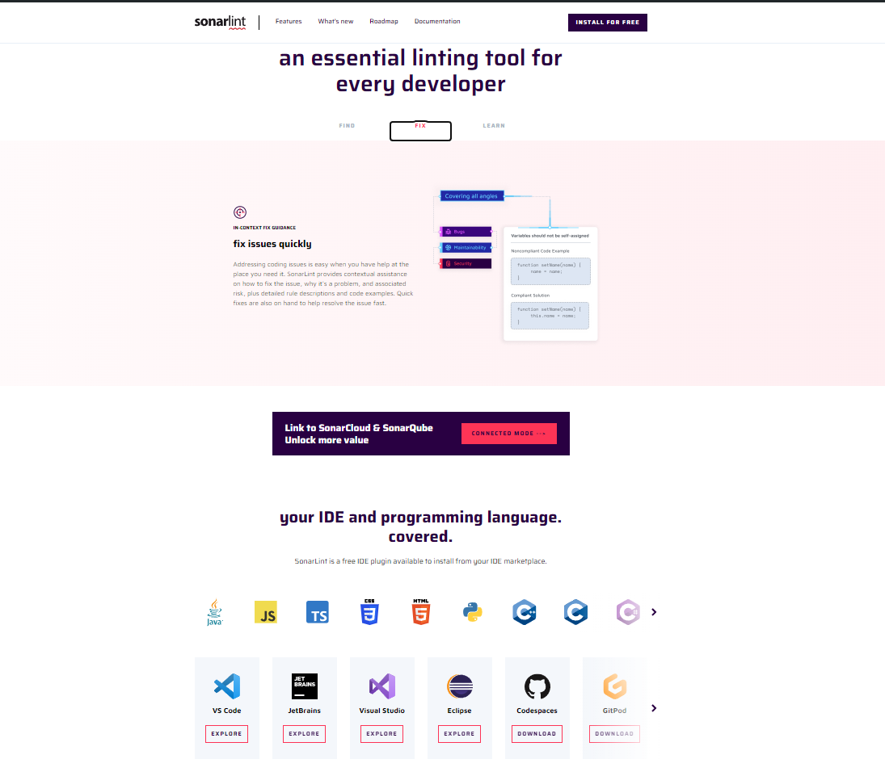
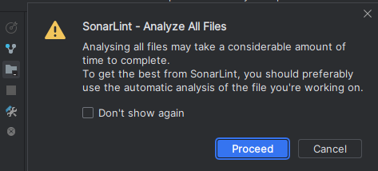
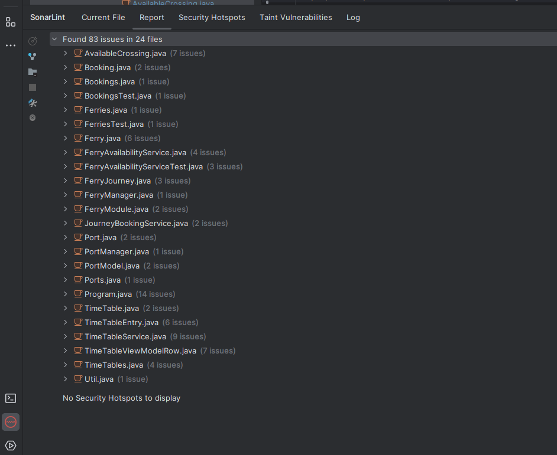
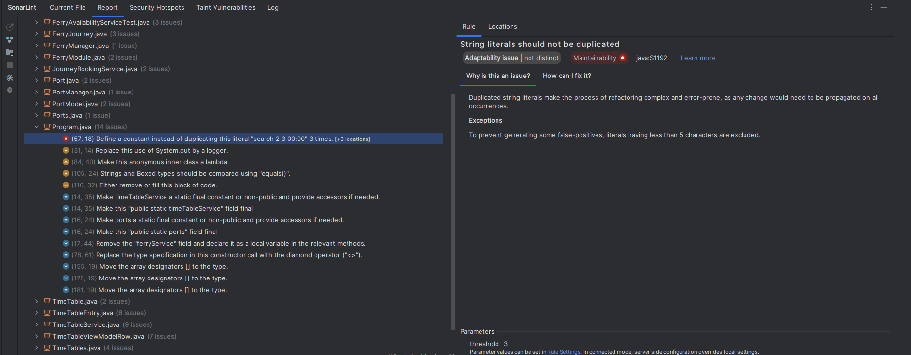
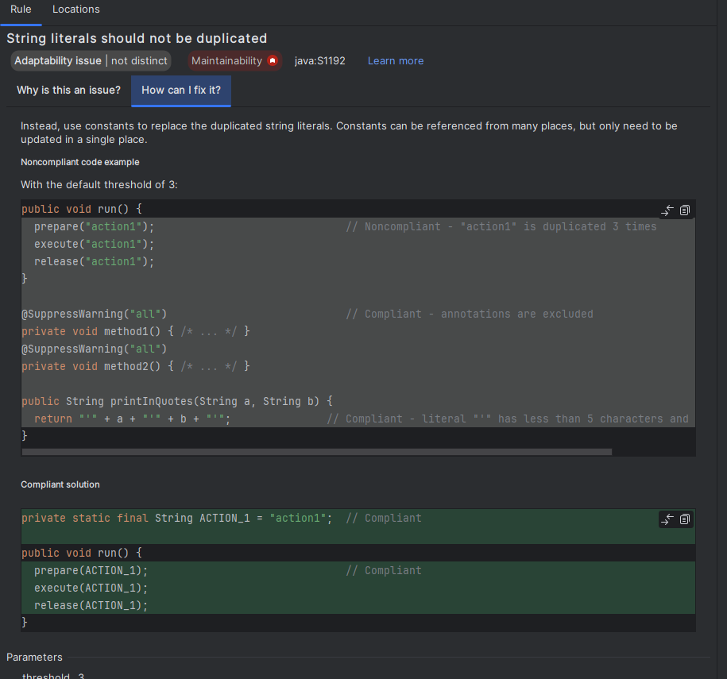
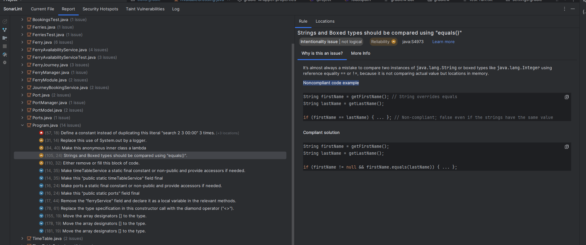
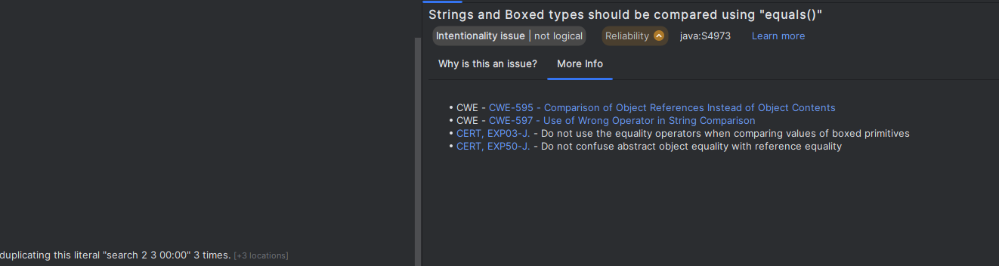

# Ferry-Legacy

_Ferry legacy es un proyecto para refinar nuestras habilidades en la detección de smell codes con una deuda técnica grave. Este proyecto posee varios aspectos a revisar como documentación , segmentación , pruebas unitarias entre otras que iremos revisando a lo largo del curso._

## Comenzando 🚀
_En entregas anteriores analizamos la deuda técnica del proyecto de manera general y establecimos unas posibles soluciones para reducir la misma. Ya habiendo identificado la deuda tecnica a manera general vamos a hacerlo de manera especifica , para esto usaremos herramientas de control de calidad que analicen el código para tener asegurar que sea un producto refactorizado y valioso, teniendo así  las mejores prácticas y la menor cantidad de deuda técnica posible._

_Este proyecto al ser creado con una versión bastante antigua no se puede analizar con la plataforma sonarcloud con GitActions, inicialmente se habia propuesto esta herramienta y al intentar linkear el proyecto con gitActions obtenemos bastantes errores de lectura impidiendo ser analizado con SonarCloud, asi que optaremos por otra alternativa: Sonarlint_ 

_SonarLint es un plugin que nos permite en tiempo real ver smell codes o issues directamente en nuestro IDE en la clase que estemos parados actualmente permitiendo corregir errores encontrados de manera facil o tambien podemos realizar un escaneo detallado del proyecto para ver el estado actual del mismo_

## SonarLint en acción ⚙️

_Para ver a detalle el estado del proyecto, realizaremos un escaneo total con el plugin SonarLint_

_una vez finalizado el escaneo obtenemos un reporte que nos indica hay 83 issues a resolver o 83 code smells:_

_Abramos la clase que más issues tiene para observar como se estructuran los reportes:_

_Como podemos ver en la imagen al desplegar la clase deseada vemos las issues que se encontraron ordenadas de mayor a menor impacto en un atributo de calidad especifico, identificadas con color rojo , amarillo y azul, de mayor a menor impacto respectivamente._

_Tambien se observa el atributo de clean code que se está fallando y una breve descripción , estos se ven sombreados al lado del atributo de calidad_

_Sonarlin nos da una explicación del issue y también el como arreglarlo_

_Miremos otra issue con un atributo de calidad diferente :_

_Podemos observar que el atributo de calidad: Reliability , en este caso el impacto es medio y nos están diciendo que la manera en que estamos comparando es incorrecta debido a que no son valores si no espacios en memoria y debemos usar la función squals_

_En el recuadro de arriba nos muestra un ejemplo de como no está bien el código y abajo cómo si se cumpliría con el atributo de calidad, adicionalmente nos proporciona varios links de referencia de CWE para el issue especifico_

## Conclusiones 🩹
  1. _El estado actual del proyecto es grave ya que poseemos 83 issues a resolver que sin duda son posibles con lo que queda del curso_
  
  2. _El proyecto incumple varios atributos de calidad y de clean code, teniendo una deuda técnica considerable_
  
  3. _El Plugin SonarLint nos es de gran ayuda debido a la versión del proyecto que no permite ser analizado de manera local ni por un workflow en gitActions con SonarCloud , siendo asi  una alternativa que nos permite analizar el código de una manera facil y rapida._
  4. _El Plugin SonarLint no permite revisar vulnerabilidad ni cuanto codigo está cubierto entre otras cosas, esto siendo una desventaja ya que tenemos que buscar una herramienta que nos permite revisar estos aspectos.
## Construido con 🛠️

_herramientas que utilizadas para en el proyecto_

* [github](https://github.com/) - Gestión de Versiones
* [gradle](https://gradle.org/) - Manejador de dependencias
* [Sonarlint](https://www.sonarsource.com/products/sonarlint/) - Análisis de código

## Autores ✒️

* **Juan José Álvarez Beltrán** - *Trabajo Inicial* - [JuanAlvarezEci](https://github.com/juanalvarezeci)

## Licencia 📄

Este proyecto está bajo la Licencia MIT  - mira el archivo [LICENSE.md](LICENSE.md) para detalles
